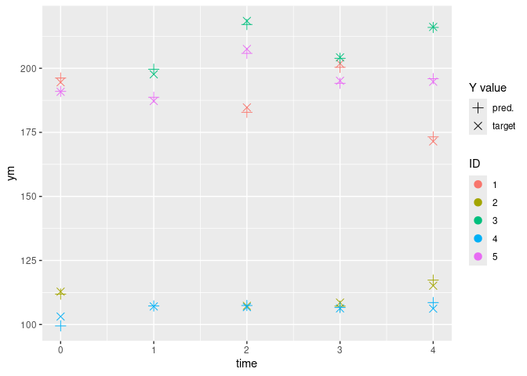

- [1 Introduction](#1-introduction)
- [2 Method](#2-method)
- [3 Example dataset](#3-example-dataset)
- [4 General principle](#4-general-principle)
- [5 Arguments](#5-arguments)
- [6 Example](#6-example)
- [7 Attributes](#7-attributes)
- [8 Functions](#8-functions)
  - [8.1 `predict`](#81-predict)
  - [8.2 `plot_conv`](#82-plot_conv)
  - [8.3 `plot_loglik`](#83-plot_loglik)
  - [8.4 `plot_last_iter`](#84-plot_last_iter)
  - [8.5 `load_backup`](#85-load_backup)

<!-- README.md is generated from README.Rmd. Please edit that file -->

# 1 Introduction

This package provides functions to train hybrid mixed effects models.
Such models are a variation of linear mixed effects models, used for
Gaussian longitudinal data, whose formulation is:

$$Y_{ij} = X_{ij} \beta +  Z_{ij} u_i + w_{ij} + \varepsilon_{ij}$$

… where $i$ is the subject, $j$ is the occasion, and $w_i$ comes from a
zero-mean Gaussian stochastic process (such as Brownian motion).

<br><br> For such hybrid models:

- a Machine Leaning (ML) model is used to estimates the fixed effects;
- a Mixed Effects model (`hlme` from [lcmm
  package](https://cecileproust-lima.github.io/lcmm/articles/lcmm.html))
  is constrained to estimate only random effects.

That is, the formulation becomes:

$$Y_{ij} = f_{ML}(X_{ij}) +  Z_{ij} u_i + w_{ij} + \varepsilon_{ij}$$

… where $f_{ML}(X_{ij})$ is the output from a ML model trained to
predict the fixed effects.

<br><br> Using ML models to estimates the fixed effects has two main
advantages comparing to linear models:

- they can handle highly non-linear relations, and do so with simple
  inputs (instead of being highly dependent of the specification);
- they can handle complex time interactions, in the case of Recurrent
  Neural Networks;

However, some ML models have a “black box” effect, as one cannot use its
estimated parameters to understand the relations within the data.

# 2 Method

The method uses a iterative training of both fixed effects and random
effects models.

So far we are fitting each model on the residuals of the other. This is
only valid for **regression problems** where it is equivalent to to
fitting using the predictions (of the other model) as offset. In
generalized linear model terms: the models use an identity link. In
neural networks terms: the models do not use a final activation
function.

The pseudo-code is as follow (`fe`/`re` stands for fixed/random
effects):

    ml_model_fe <- initiate_ml_model_fe()
    hlme_model_re <- initiate_hlme_model_re()

    Yre <- 0.
    while not converged:
      fit ml_model_fe on X and (Y - Yre)
      Yfe <-  ml_model_fe(X)

      fit hlme_model_re on X and (Y - Yfe)
      Yre <-  hlme_model_re(X)

      converged <- criterion(Y, Yfe+Yre)

# 3 Example dataset

The dataset `data_mixedml` is proposed. It is generated using the
`R/data_gen.R` file.

It is a synthetic longitudinal dataset, containing data for 10 subjects
on 5 regularly spaced time steps. It contains two response columns for
both fixed and mixed effects. NA values have been added manually in
these columns:

``` r
data_mixedml
#>    ID time    x1    x2 x3    yf     yr    ym ym_nonoise
#> 1   1    0 10.38 100.6  1 206.9 -12.76 194.5      194.2
#> 2   1    1    NA 103.5  1    NA -13.29    NA         NA
#> 3   1    2  9.82  97.9  1 197.3 -12.29 184.7      185.0
#> 4   1    3 11.01  98.2  1 215.3 -12.88 201.8      202.4
#> 5   1    4  8.89  98.5  1 183.6 -11.89 171.5      171.7
#> 6   2    0 10.38  97.5  0 101.7  10.97 112.8      112.6
#> 7   2    1  9.35  99.3  0    NA  11.28    NA         NA
#> 8   2    2  9.60    NA  0  97.8  11.06 107.3      108.9
#> 9   2    3  9.10 102.2  0  97.6  11.66 108.6      109.3
#> 10  2    4  9.98 103.8  0 102.8  11.79 115.1      114.6
#> 11  3    1  9.11  97.3  1 186.4  11.92 197.6      198.3
#> 12  3    2 10.43  96.0  1 205.5  12.65 218.5      218.2
#> 13  3    3  9.14 105.8  1 191.0  12.48 204.3      203.5
#> 14  3    4 10.07 102.0  1 203.0  12.81 216.1      215.8
#> 15  4    0  9.96  98.8  0 100.2   3.43 103.1      103.6
#> 16  4    1 10.43 100.6  0 103.4   3.29 107.1      106.7
#> 17  4    2 10.17 101.2  0 102.5   3.53 106.8      106.0
#> 18  4    3  9.71 104.9  0 102.0   4.23 106.3      106.2
#> 19  4    4 10.39  99.8  0 102.9   3.24 106.2      106.1
#> 20  5    0  9.65  99.1  1 195.3  -3.75 190.8      191.6
#> 21  5    1  9.41  99.6  1 191.9  -3.72 187.2      188.2
#> 22  5    2 10.63 102.1  1 211.6  -3.97 207.5      207.6
#> 23  5    3  9.84 100.6  1 198.9  -3.81 195.1      195.1
#> 24  5    4 10.02  96.3  1 199.4  -3.74 194.8      195.6
#> 25  6    0  9.26  99.8  0  97.2  16.39 113.9      113.6
#> 26  6    1  9.44  97.6  0  97.0  16.24 113.7      113.2
#> 27  6    2  9.12  91.2  0  92.2  15.33 108.3      107.5
#> 28  6    3  9.47  98.1  0  97.4  16.31 114.1      113.7
#> 29  6    4  9.33  98.3  0  96.8  16.26 112.6      113.1
#> 30  7    0 10.38 104.5  1 208.9  -6.09 202.7      202.8
#> 31  7    1  9.68 102.7  1 197.5  -5.55 192.6      192.0
#> 32  7    2 10.72  99.0  1 211.2  -6.52 204.5      204.7
#> 33  7    3  9.69  96.1  1 194.4  -5.73 189.8      188.7
#> 34  7    4 10.11 100.0  1 202.7  -5.99 196.1      196.7
#> 35  8    0 10.13 103.0  0 103.2  -7.37  96.1       95.8
#> 36  8    1 10.21 101.2  0 102.7  -7.30  94.6       95.4
#> 37  8    2  9.26 104.3  0  99.4  -7.24  92.9       92.2
#> 38  8    3 10.09 100.4  0 101.7  -7.23  94.8       94.4
#> 39  8    4 11.03  96.0  0 104.1  -7.22  96.6       96.9
#> 40  9    0 10.36  98.5  1 205.7   2.49 208.0      208.2
#> 41  9    1  9.76  97.3  1 196.0   2.51 198.4      198.5
#> 42  9    2  9.76 101.0  1 197.8   2.64 201.2      200.5
#> 43  9    3 10.92 100.9  1 215.3   2.51 217.7      217.8
#> 44  9    4 10.26  96.9  1 203.3   2.44 205.5      205.7
#> 45 10    0  9.44 101.2  0  98.8 -21.28  77.2       77.5
#> 46 10    1  9.84 102.4  0 101.4 -21.84  79.4       79.6
#> 47 10    2 10.05  98.3  0 100.4 -21.58  77.4       78.8
#> 48 10    3 10.32 100.5  0 102.9 -22.11  81.6       80.8
#> 49 10    4 10.19 100.1  0 102.0 -21.93  80.2       80.1
```

# 4 General principle

The MixedML models are obtained using specific functions which have for
signature:

``` r
some_mixed_ml_model(
  # parameters of the MixedML model (inpired by the hlme function definition)
  fixed_spec,
  random_spec,
  data_,
  subject,
  time,
  # parameters for MixedML method
  mixedml_controls,
  # controls (extra-parameters) for the hlme model
  hlme_controls,
  # controls (extra-parameters) for the implemented ML model
  controls_1, controls_2, et_caetera
)
```

# 5 Arguments

The `fixed_spec`, `random_spec`, `cor`, `data`, `subject` and `time` are
used by both sub-models and are taken from the `hlme` function which can
be seen in [the lcmm package
documentation](https://cecileproust-lima.github.io/lcmm/reference/hlme.html)

Then several controls are defined, using specific functions whose names
correspond to the control names. That is, the `some_name_ctrls(…)`
function is used to define `some_name_controls` controls. Each control
has its specific help.

# 6 Example

Here is an example using the `reservoir_mixedml` function (here is the
[corresponding vignette](mixedML_reservoir.html):

``` r
model_reservoir <- reservoir_mixedml(
  fixed_spec = ym ~ x1 + x2 + x3,
  random_spec = ~ x1 + x2,
  data = data_mixedml,
  subject = "ID",
  time = "time",
  # parameters for MixedML method
  mixedml_controls = mixedml_ctrls(),
  # controls (extra-parameters) for the hlme model
  hlme_controls = hlme_ctrls(maxiter = 50, idiag = TRUE),
  # controls (extra-parameters) for the ML model
  esn_controls = esn_ctrls(units = 20, ridge = 1e-5),
  ensemble_controls = ensemble_ctrls(seed_list = c(1, 2, 3, 4, 5)),
  fit_controls = fit_ctrls(warmup = 2),
  output_dir = "mixedML_vignette"
)
#> conda environment "01" activated!
#> Warning in .check_na_combinaison(data, fixed_spec, random_spec, target_name): 
#>          2 incomplete cases for the ML models
#>          3 incomplete cases for the HLME model
#>          2 NA values in target
#>          => 3/49 observations could not be used to train (either no fixed preds, random preds or target).
#> step#0
#>  fitting fixed effects...
#>  fitting random effects...
#>  MSE = 851
#> step#1
#>  fitting fixed effects...
#>  fitting random effects...
#>  MSE = 437.8
#> step#2
#>  fitting fixed effects...
#>  fitting random effects...
#>  MSE = 180.9
#> step#3
#>  fitting fixed effects...
#>  fitting random effects...
#>  MSE = 55.87
#> step#4
#>  fitting fixed effects...
#>  fitting random effects...
#>  MSE = 24.91
#> step#5
#>  fitting fixed effects...
#>  fitting random effects...
#>  MSE = 6.633
#> step#6
#>  fitting fixed effects...
#>  fitting random effects...
#>  MSE = 3.618
#> step#7
#>  fitting fixed effects...
#>  fitting random effects...
#>  MSE = 2.875
#> step#8
#>  fitting fixed effects...
#>  fitting random effects...
#>  MSE = 2.454
#> step#9
#>  fitting fixed effects...
#>  fitting random effects...
#>  MSE = 1.933
#> step#10
#>  fitting fixed effects...
#>  fitting random effects...
#>  MSE = 1.908
#> step#11
#>  fitting fixed effects...
#>  fitting random effects...
#>  MSE = 2.159
#> step#12
#>  fitting fixed effects...
#>  fitting random effects...
#>  MSE = 2.07
#> step#13
#>  fitting fixed effects...
#>  fitting random effects...
#>  MSE = 2.259
#> Final convergence of HLME with strict convergence criterions.
```

The resulting model will be used in the remaining sections.

# 7 Attributes

Each sub-models are accessible from the fitted MixedML model:

``` r
model_reservoir$random_model
#> Heterogenous linear mixed model 
#>      fitted by maximum likelihood method 
#>  
#> hlme(fixed = ym ~ 1, random = ~x1 + x2, subject = "ID", idiag = TRUE, 
#>     cor = NULL, data = data, convB = hlme_controls_final$convB, 
#>     convL = hlme_controls_final$convL, convG = hlme_controls_final$convG, 
#>     maxiter = 50, na.action = 1, posfix = 1, verbose = FALSE, 
#>     var.time = "time", nproc = 1)
#>  
#> Statistical Model: 
#>      Dataset: data 
#>      Number of subjects: 10 
#>      Number of observations: 46 
#>      Number of observations deleted: 3 
#>      Number of latent classes: 1 
#>      Number of parameters: 5  
#>      Number of estimated parameters: 4  
#>  
#> Iteration process: 
#>      Convergence criteria satisfied 
#>      Number of iterations:  12 
#>      Convergence criteria: parameters= 8.8e-05 
#>                          : likelihood= 7.3e-06 
#>                          : second derivatives= 3e-11 
#>  
#> Goodness-of-fit statistics: 
#>      maximum log-likelihood: -124.06  
#>      AIC: 256.12  
#>      BIC: 257.33  
#>  
#> 
```

``` r
# (this model uses reticulate so it not very convenient as an example…)
model_reservoir$fixed_model
#> <reservoir_ensemble.JoblibReservoirEnsemble object at 0x7092d4375940>
```

Also a `call` attribute exists, meaning one can trained the model with
new inputs using `update` command:

``` r
new_model_reservoir <- update(model_reservoir, data = new_data, maxiter = new_maxiter)
```

# 8 Functions

The function `predict`, `plot_conv`, `plot_last_iter` are common to all
fitted MixedML models.

The function `load_backup` can be used to inspect the model and the
predictions of a specific iteration.

## 8.1 `predict`

**Description**

Predict using a fitted model and new data

**Usage**

``` r
predict(model, data)
```

**Arguments**

- `model`: Trained MixedML model
- `data`: New data (same format as the one used for training)

**Value**

prediction

## 8.2 `plot_conv`

**Description**

Plot the (MSE) convergence of the MixedML training

**Usage**

``` r
plot_conv(model, ylog = TRUE)
```

**Arguments**

- `model`: Trained MixedML model
- `ylog`: Plot the y-value with a log scale. Default: TRUE.

**Value**

Convergence plot

``` r
plot_conv(model = model_reservoir)
```


## 8.3 `plot_loglik`

**Description**

Plot the log-likelihood of the random effect hlme during training

**Usage**

``` r
plot_loglik(model, ylog = TRUE)
```

**Arguments**

- `model`: Trained MixedML model
- `ylog`: Plot the y-value with a log scale. Default: TRUE.

**Value**

Log-likelihood plot

``` r
plot_loglik(model = model_reservoir)
```


## 8.4 `plot_last_iter`

**Description**

Plot the prediction of a MixedML model

**Usage**

``` r
plot_last_iter(model, subject_nb_or_list, ylog = FALSE)
```

**Arguments**

- `model`: Trained MixedML model.
- `subject_nb_or_list`: Number of subjects to plot (randomly selected)
  or list of subjects to plot.
- `ylog`: Plot the y-value with a log scale. Default: TRUE.

**Value**

Prediction plot of the model.

``` r
plot_last_iter(model = model_reservoir, subject_nb_or_list = c(1, 2, 3, 4, 5))
#> Warning: Removed 5 rows containing missing values or values outside the scale range
#> (`geom_point()`).
```



## 8.5 `load_backup`

``` r
backup <- load_backup(
  fixed_model_rds_or_joblib = "mixedML_vignette/007_fixed_model.joblib",
  random_model_rds = "mixedML_vignette/007_random_model.Rds"
)
```

``` r
backup$fixed_model
#> <reservoir_ensemble.JoblibReservoirEnsemble object at 0x70925dc9dd10>
```

``` r
backup$random_model
#> Heterogenous linear mixed model 
#>      fitted by maximum likelihood method 
#>  
#> hlme(fixed = ym ~ 1, random = ~x1 + x2, subject = "ID", idiag = TRUE, 
#>     cor = NULL, data = data, convB = 0.01, convL = 0.01, convG = 0.01, 
#>     maxiter = 50, na.action = 1, posfix = 1, verbose = FALSE, 
#>     var.time = "time", nproc = 1)
#>  
#> Statistical Model: 
#>      Dataset: data 
#>      Number of subjects: 10 
#>      Number of observations: 46 
#>      Number of observations deleted: 3 
#>      Number of latent classes: 1 
#>      Number of parameters: 5  
#>      Number of estimated parameters: 4  
#>  
#> Iteration process: 
#>      Convergence criteria satisfied 
#>      Number of iterations:  6 
#>      Convergence criteria: parameters= 0.00021 
#>                          : likelihood= 8.9e-07 
#>                          : second derivatives= 1.3e-08 
#>  
#> Goodness-of-fit statistics: 
#>      maximum log-likelihood: -137.82  
#>      AIC: 283.64  
#>      BIC: 284.85  
#>  
#> 
```

``` r
predict(backup, data_mixedml)
#>  [1] 197.2    NA 370.1 392.3 357.8  68.6 168.4    NA 175.4 187.9 181.4 400.0
#> [13] 395.9 410.7  63.5 176.8 176.4 176.2 178.3 186.5 372.9 401.1 384.8 383.4
#> [25]  58.4 175.4 168.7 175.7 174.9 199.1 383.3 396.1 372.0 388.9  70.3 163.4
#> [37] 159.9 165.2 167.6 195.3 382.6 393.3 413.4 395.4  60.9 144.6 146.6 151.7
#> [49] 148.9
```

``` r
unlink("mixedML_vignette", recursive = TRUE)
```
