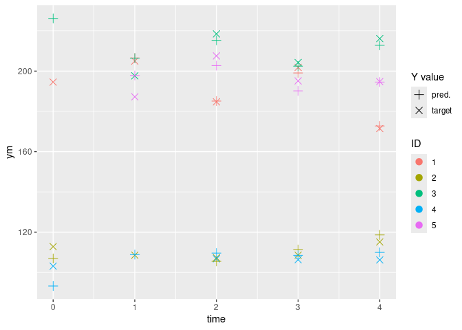
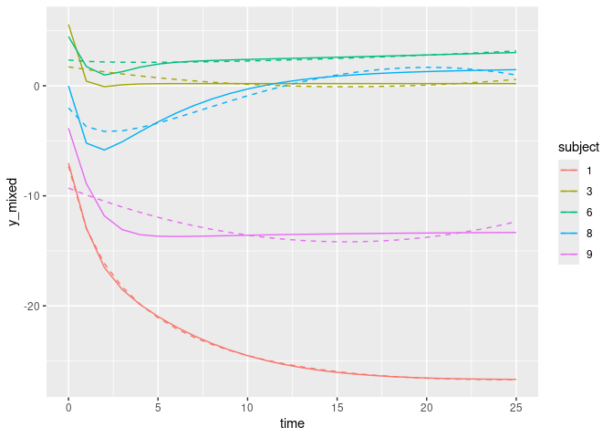

<!-- README.md is generated from README.Rmd. Please edit that file -->

# 1 Introduction

This package provides functions to train hybrid mixed effects models.
Such models are a variation of linear mixed effects models, used for
Gaussian longitudinal data, whose formulation is:

$Y_{ij} = X_{ij} \beta +  Z_{ij} u_i + w_{ij} + \varepsilon_{ij}$

… where $i$ is the subject, $j$ is the occasion, and $w_i$ comes from a
zero-mean Gaussian stochastic process (such as Brownian motion),

For such hybrid models:

- a Machine Leaning (ML) model is used to estimates the fixed effects;
- a Mixed Effects model (`hlme` from [lcmm
  package](https://cecileproust-lima.github.io/lcmm/articles/lcmm.html))
  is used to estimate the random effects.

That is, the formulation becomes:

$Y_{ij} = f_{ML}(X_{ij}) +  Z_{ij} u_i + w_{ij} + \varepsilon_{ij}$

… where $f_{ML}(X_{ij})$ is the output from a ML model trained to
predict the fixed effects.

Using ML models to estimates the fixed effects have tow main advantages
comparing to linear models:

- they can handle highly non-linear relations, and do so with simple
  inputs (instead of being highly dependent of the specification);
- they can handle complex time interactions, in the case of Recurrent
  Neural Networks;

However, some ML models have a “black box” effect, as one cannot use its
estimated parameters to understand the relations within the data.

# 2 General MixedML use

## 2.1 General principle

The MixedML models are obtained using specific functions which have for
signature:

``` r
some_mixed_ml_model(
  # parameters of the MixedML model (inpired by the hlme function definition)
  fixed_spec,
  random_spec,
  data,
  subject,
  time,
  # parameters for MixedML method
  mixedml_controls,
  # controls (extra-parameters) for the hlme model
  hlme_controls,
  # controls (extra-parameters) for the ML model
  controls_1, controls_2, et_caetera
)
```

The `fixed_spec`, `random_spec`, `cor`, `data`, `subject` and `time`
parameters are taken from the `hlme` function and can be seen in [the
lcmm package
documentation](https://cecileproust-lima.github.io/lcmm/reference/hlme.html)

## 2.2 Controls

Controls are defined using specific functions, whose names correspond to
the control names: the `some_name_ctrls` function is used to define
`some_name_controls` controls.

`mixedml_controls` and `hlme_controls` are common to all MixedML models.

### 2.2.1 `mixedml_controls`

# 3 Prepare the mixedml_controls

## 3.1 Description

Prepare the mixedml_controls

## 3.2 Usage

``` r
mixedml_ctrls(patience = 2, conv_ratio_thresh = 0.01)
```

## 3.3 Arguments

- `patience`: Number of iterations without improvement before the
  training is stopped. Default: 2
- `conv_ratio_thresh`: Ratio of improvement of the MSE to consider an
  improvement. `conv_ratio_thresh=0.01` means an improvement of at least
  1% of the MSE is necessary. Default: 0.01

## 3.4 Value

mixedml_controls

### 3.4.1 `hlme_controls`

# 4 Prepare the hlme_controls

## 4.1 Description

Please see the
[documentation](https://cecileproust-lima.github.io/lcmm/reference/hlme.html)of
the `hlme` function of the `lcmm` package.

## 4.2 Usage

``` r
hlme_ctrls(cor = NULL, idiag = FALSE, maxiter = 500, nproc = 1)
```

## 4.3 Arguments

- `cor`: brownian motion or autoregressive process modeling the
  correlation between the observations. “BM” or “AR” should be
  specified, followed by the time variable between brackets.
- `idiag`: logical for the structure of the variance-covariance matrix
  of the random-effects. If FALSE, a non structured matrix of
  variance-covariance is considered (by default). If TRUE a diagonal
  matrix of variance-covariance is considered.
- `maxiter`: maximum number of iterations for the Marquardt iterative
  algorithm.
- `nproc`: the number cores for parallel computation. Default to 1
  (sequential mode).

## 4.4 Value

hlme_controls

## 4.5 Functions

The function `predict` and `plot_conv` are common to all the MixedML
models

### 4.5.1 `predict`

# 5 Predict using a fitted model and new data

## 5.1 Description

Predict using a fitted model and new data

## 5.2 Usage

``` r
predict(model, data)
```

## 5.3 Arguments

- `model`: Trained MixedML model
- `data`: New data (same format as the one used for training)

## 5.4 Value

prediction

### 5.4.1 `plot_conv`

# 6 Plot the (MSE) convergence of the MixedML training

## 6.1 Description

Plot the (MSE) convergence of the MixedML training

## 6.2 Usage

``` r
plot_conv(model, ylog = TRUE)
```

## 6.3 Arguments

- `model`: Trained MixedML model
- `ylog`: Plot the y-value with a log scale. Default: TRUE.

## 6.4 Value

Convergence plot

# 7 Implementations

So far, a hybrid model based on Reservoir Computing is available. They
are implemented by interfacing the
[reservoirpy](https://github.com/reservoirpy/reservoirpy) Python package
with R using [reticulate](https://github.com/rstudio/reticulate).

## 7.1 MixedML with Reservoir Computing

The function `reservoir_mixedml` is used to define and fit a MixedML
model which uses an Reservoir Computing to fit the fixed effect.

# 8 MixedML model with Reservoir Computing

## 8.1 Description

Generate and fit a MixedML model using an Ensemble of Echo State
Networks (Reservoir+Ridge Regression) to fit the fixed effects.

## 8.2 Usage

``` r
reservoir_mixedml(
  fixed_spec,
  random_spec,
  data,
  subject,
  time,
  mixedml_controls = mixedml_ctrls(),
  hlme_controls = hlme_ctrls(),
  esn_controls = esn_controls(),
  ensemble_controls = ensemble_controls(),
  fit_controls = fit_controls()
)
```

## 8.3 Arguments

- `fixed_spec`: two-sided linear formula object for the fixed-effects.
  The response outcome is on the left of ~ and the covariates are
  separated by + on the right of ~.
- `random_spec`: two-sided formula for the random-effects in the linear
  mixed model. The response outcome is on the left of ~ and the
  covariates are separated by + on the right of ~. By default, an
  intercept is included. If no intercept, -1 should be the first term
  included.
- `data`: dataframe containing the variables named in `fixed_spec`,
  `random_spec`, `subject` and `time`.
- `subject`: name of the covariate representing the grouping structure,
  given as a string/character.
- `time`: name of the time variable, given as a string/character.
- `mixedml_controls`: controls specific to the MixedML model
- `hlme_controls`: controls specific to the HLME model
- `esn_controls`: controls specific to the ESN models
- `ensemble_controls`: controls specific to the Ensemble model
- `fit_controls`: controls specific to the ESN models fit

## 8.4 Value

fitted MixedML model

Reservoir Computing is implemented using an ensemble of Echo State
Network (Reservoir + Ridge readout), whose Reservoirs are initialized
with different random seeds. The prediction of the ensemble model is
calculated as the mean or median of all the ENS prediction, which
reduces the impact of the Reservoir initialization on the results.

Four controls are used to define the RC model’s behavior.

### 8.4.1 `esn_controls`

# 9 Prepare the esn_controls

## 9.1 Description

Please see the documentation of ReservoirPy for:

- [Reservoir](https://reservoirpy.readthedocs.io/en/latest/api/generated/reservoirpy.nodes.Reservoir.html)
- [Ridge
  Regression](https://reservoirpy.readthedocs.io/en/latest/api/generated/reservoirpy.nodes.Ridge.html)

## 9.2 Usage

``` r
esn_ctrls(units = 100, lr = 1, sr = 0.1, ridge = 0, feedback = FALSE)
```

## 9.3 Arguments

- `units`: Number of reservoir units.
- `lr`: Neurons leak rate. Must be in $[0,1]$.
- `sr`: Spectral radius of recurrent weight matrix.
- `ridge`: Regularization parameter $\lambda$.
- `feedback`: Is readout connected to reservoir through feedback?

## 9.4 Value

esn_controls

### 9.4.1 `ensemble_controls`

# 10 Prepare the ensemble_controls

## 10.1 Description

Prepare the ensemble_controls

## 10.2 Usage

``` r
ensemble_ctrls(seed_list = c(1, 2, 3), agg_func = "median", n_procs = 1)
```

## 10.3 Arguments

- `seed_list`: List of seeds used to generate the Reservoir. Default:
  c(1, 2, 3)
- `agg_func`: Function used to aggregate the predictions of each ESN.
  “mean” or “median”. Default: “median”
- `n_procs`: Number of processor to use. 1 means no multiprocessing.
  Default: 1.

## 10.4 Value

ensemble_controls

## 10.5 `fit_controls`

# 11 Prepare the fit_controls

## 11.1 Description

Please see the
[documentation](https://reservoirpy.readthedocs.io/en/latest/api/generated/reservoirpy.nodes.ESN.html#reservoirpy.nodes.ESN.fit)of
ReservoirPy

## 11.2 Usage

``` r
fit_ctrls(warmup = 0)
```

## 11.3 Arguments

- `warmup`: Number of timesteps to consider as warmup and discard at the
  beginning. Defalut: 0 of each timeseries before training.

## 11.4 Value

fit_controls

# 12 Example

``` r
model <- reservoir_mixedml(
  fixed_spec = y_mixed ~ x1 + x2 + x3 + x8,
  random_spec = y_mixed ~ x1 + x2 + x3 + x8,
  data = data_mixedml[data_mixedml["subject"] < 10, ],
  subject = "subject",
  time = "time",
  mixedml_controls = mixedml_ctrls(),
  hlme_controls = hlme_ctrls(nproc = 5, maxiter = 10, idiag = TRUE),
  esn_controls = esn_ctrls(units = 20, ridge = 1e-5),
  ensemble_controls = ensemble_ctrls(seed_list = c(1, 2, 3)),
  fit_controls = fit_ctrls(warmup = 2)
)
#> conda environment "01" activated!
#> step#0
#>  fitting fixed effects...
#>  fitting random effects...
#>  MSE = 0.4412
#> step#1
#>  fitting fixed effects...
#>  fitting random effects...
#>  MSE = 0.4411
#> step#2
#>  fitting fixed effects...
#>  fitting random effects...
#>  MSE = 0.4372
#> step#3
#>  fitting fixed effects...
#>  fitting random effects...
#>  MSE = 0.4422
```

``` r
summary(model$random_model)
#> Heterogenous linear mixed model 
#>      fitted by maximum likelihood method 
#>  
#> hlme(fixed = y_mixed ~ 1, random = ~x1 + x2 + x3 + x8, subject = "subject", 
#>     idiag = TRUE, cor = NULL, data = data, maxiter = 10, posfix = 1, 
#>     var.time = "time", nproc = 5)
#>  
#> Statistical Model: 
#>      Dataset: data 
#>      Number of subjects: 9 
#>      Number of observations: 234 
#>      Number of latent classes: 1 
#>      Number of parameters: 7  
#>      Number of estimated parameters: 6  
#>  
#> Iteration process: 
#>      Maximum number of iteration reached without convergence 
#>      Number of iterations:  10 
#>      Convergence criteria: parameters= 110 
#>                          : likelihood= 0.38 
#>                          : second derivatives= 0.11 
#>  
#> Goodness-of-fit statistics: 
#>      maximum log-likelihood: -375.23  
#>      AIC: 762.46  
#>      BIC: 763.64  
#>  
#>  
#> Maximum Likelihood Estimates: 
#>  
#> Fixed effects in the longitudinal model:
#> 
#>                 coef  Se Wald p-value
#> intercept    0.00000*                
#> 
#> 
#> Variance-covariance matrix of the random-effects:
#>           intercept      x1       x2     x3      x8
#> intercept  5799.386                                
#> x1            0.000 1.67578                        
#> x2            0.000 0.00000 60.31593               
#> x3            0.000 0.00000  0.00000 782.29        
#> x8            0.000 0.00000  0.00000   0.00 0.25508
#> 
#>                                coef Se
#> Residual standard error:    0.71290   
#> 
#>  * coefficient fixed by the user 
#> 
```

``` r
plot_conv(model)
```



``` r
plot_last_iter(model, subject_nb_or_list = 5)
#> Subjects selected randomly: use set.seed to change the selection.
```


