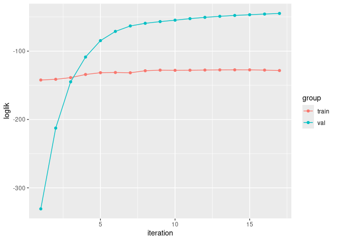

- [1 Introduction](#1-introduction)
- [2 Method](#2-method)
- [3 Example dataset](#3-example-dataset)
- [4 General principle](#4-general-principle)
- [5 Arguments](#5-arguments)
  - [5.1 Attributes](#51-attributes)
- [6 Functions](#6-functions)
  - [6.1 `predict`](#61-predict)
  - [6.2 `plot_conv`](#62-plot_conv)
  - [6.3 `plot_last_iter`](#63-plot_last_iter)

<!-- README.md is generated from README.Rmd. Please edit that file -->

# 1 Introduction

This package provides functions to train hybrid mixed effects models.
Such models are a variation of linear mixed effects models, used for
Gaussian longitudinal data, whose formulation is:

$$Y_{ij} = X_{ij} \beta +  Z_{ij} u_i + w_{ij} + \varepsilon_{ij}$$

… where $i$ is the subject, $j$ is the occasion, and $w_i$ comes from a
zero-mean Gaussian stochastic process (such as Brownian motion).

<br><br> For such hybrid models:

- a Machine Leaning (ML) model is used to estimates the fixed effects;
- a Mixed Effects model (`hlme` from [lcmm
  package](https://cecileproust-lima.github.io/lcmm/articles/lcmm.html))
  is constrained to estimate only random effects.

That is, the formulation becomes:

$$Y_{ij} = f_{ML}(X_{ij}) +  Z_{ij} u_i + w_{ij} + \varepsilon_{ij}$$

… where $f_{ML}(X_{ij})$ is the output from a ML model trained to
predict the fixed effects.

<br><br> Using ML models to estimates the fixed effects has two main
advantages comparing to linear models:

- they can handle highly non-linear relations, and do so with simple
  inputs (instead of being highly dependent of the specification);
- they can handle complex time interactions, in the case of Recurrent
  Neural Networks;

However, some ML models have a “black box” effect, as one cannot use its
estimated parameters to understand the relations within the data.

# 2 Method

The method uses a iterative training of both fixed effects and random
effects models. The pseudo-code is as follow (`fe`/`re` stands for
fixed/random effects):

    ml_model_fe <- initiate_ml_model_fe()
    hlme_model_re <- initiate_hlme_model_re()

    Yre <- 0.
    while not converged:
      fit ml_model_fe on X and (Y - Yre)
      Yfe <-  ml_model_fe(X)

      fit hlme_model_re on X and (Y - Yfe)
      Yre <-  hlme_model_re(X)
      
      converged <- criterion(Y, Yfe+Yre)

# 3 Example dataset

The dataset `data_mixedml` is proposed: it is a synthetic longitudinal
dataset, containing data for 500 subjects on 26 regularly spaced time
steps ($t \in [0,25]$).

Here’s a snippet:

``` r
idx_print <- (data_mixedml[["subject"]] < 4) & (data_mixedml[["time"]] < 5)
data_print <- data_mixedml[idx_print,]
row.names(data_print) <- NULL
print(data_print, digits = 2, row.names = FALSE)
#>  subject time   x1   x2  x3  x4       x5   x6    x7 x8 y_mixed y_fixed
#>        1    0  2.9 -7.9 3.1 5.2 -0.99728 0.30 3.041  0  -7.022  -9.216
#>        1    1  4.4 -7.4 3.1 5.1 -0.45795 0.34 3.340  0 -12.940 -13.169
#>        1    2  5.8 -7.2 3.1 5.0 -0.16270 0.38 3.634  0 -16.502 -15.707
#>        1    3  7.3 -7.0 3.1 5.0 -0.05143 0.42 3.916  0 -18.519 -17.307
#>        1    4  8.7 -6.8 3.1 4.9 -0.01561 0.46 4.183  0 -19.883 -18.491
#>        2    0  3.4 -7.6 2.2 4.4 -0.61726 0.60 2.490  1  -3.022  -6.521
#>        2    1  4.5 -7.0 2.2 4.4 -0.44499 0.60 3.621  1  -8.225 -11.877
#>        2    2  5.6 -6.6 2.2 4.3 -0.29761 0.61 4.365  1 -11.702 -15.412
#>        2    3  6.7 -6.3 2.2 4.3 -0.18746 0.61 4.730  1 -13.594 -17.238
#>        2    4  7.8 -6.1 2.2 4.3 -0.11315 0.61 4.883  1 -14.526 -18.070
#>        3    0  3.4 -7.7 3.1 2.0 -1.37826 0.24 2.488  0   5.575   2.018
#>        3    1  5.3 -7.7 3.1 2.1 -0.29379 0.24 0.950  0   0.416  -0.399
#>        3    2  7.2 -7.7 3.1 2.2 -0.03868 0.24 0.262  0  -0.082  -0.322
#>        3    3  9.1 -7.7 3.1 2.3 -0.00467 0.24 0.064  0   0.089  -0.098
#>        3    4 11.0 -7.7 3.1 2.3 -0.00056 0.24 0.015  0   0.167  -0.018
```

<br> The purely fixed effects response, $y_{fixed}$ is calculated as:
$$y_{fixed} = \gamma_{0} + 
\gamma_{1} \cdot  x_2 \cdot x_5 + 
\gamma_{2} \cdot  x_4 \cdot x_7 +
\gamma_{3} \cdot  x_6 \cdot x_8$$ … where $\gamma_{0}= -0.9826036$,
$\gamma_{1} = -0.4289147$, $\gamma_{2} = -0.0456483$ and
$\gamma_{3} = -0.8542527$

<br> The mixed effects response, $y_{mixed}$ is calculated for each
individual $i$ as: $$y_{mixed,i} = \gamma_{0,i} + 
\gamma_{1,i} \cdot  x_2 \cdot x_5 + 
\gamma_{2,i} \cdot  x_4 \cdot x_7 +
\gamma_{3,i} \cdot  x_6 \cdot x_8$$ …where each $\gamma_{k,i}$ is draw
from a normal distribution with: - for $\gamma_{0,i}$, a mean of
$\gamma_{0}$ and a standard deviation of $0.5$, - for $\gamma_{1,i}$, a
mean of $\gamma_{1}$ and a standard deviation of $0.5$, - for
$\gamma_{2,i}$, a mean of $\gamma_{2}$ and a standard deviation of
$0.05$, - for $\gamma_{3,i}$, a mean of $\gamma_{3}$ and a standard
deviation of $0.1$.

That is, one can train a MixedML model using $y_mixed$ then use
$y_fixed$ to check how well both sub-model are fitted for their specific
task.

Let’s defined sub-datasets for the next examples:

``` r
data_1 <- data_mixedml[data_mixedml[["subject"]] %in% seq(01, 10), ]
data_2 <- data_mixedml[data_mixedml[["subject"]] %in% seq(11, 12), ]
```

# 4 General principle

The MixedML models are obtained using specific functions which have for
signature:

``` r
some_mixed_ml_model(
  # parameters of the MixedML model (inpired by the hlme function definition)
  fixed_spec,
  random_spec,
  data,
  subject,
  time,
  # parameters for MixedML method
  mixedml_controls,
  # controls (extra-parameters) for the hlme model
  hlme_controls,
  # controls (extra-parameters) for the implemented ML model
  controls_1, controls_2, et_caetera
)
```

# 5 Arguments

The `fixed_spec`, `random_spec`, `cor`, `data`, `subject` and `time` are
used by both sub-models and are taken from the `hlme` function which can
be seen in [the lcmm package
documentation](https://cecileproust-lima.github.io/lcmm/reference/hlme.html)

Then several controls are defined, using specific functions whose names
correspond to the control names. That is, the `some_name_ctrls(…)`
function is used to define `some_name_controls` controls. Each control
has its specific help.

Here is an example using the `reservoir_mixedml` function (the resulting
model will be used in the remaining sections):

``` r
model_reservoir <- reservoir_mixedml(
  fixed_spec = y_mixed ~ x1 + x2 + x3 + x8,
  random_spec = y_mixed ~ x1 + x2 + x3 + x8,
  data = data_1,
  subject = "subject",
  time = "time",
  # parameters for MixedML method
  mixedml_controls = mixedml_ctrls(),
  # controls (extra-parameters) for the hlme model
  hlme_controls = hlme_ctrls(nproc = 5, maxiter = 10, idiag = TRUE),
  # controls (extra-parameters) for the ML model
  esn_controls = esn_ctrls(units = 20, ridge = 1e-5),
  ensemble_controls = ensemble_ctrls(seed_list = c(1, 2, 3)),
  fit_controls = fit_ctrls(warmup = 2)
)
#> conda environment "01" activated!
#> step#0
#>  fitting fixed effects...
#>  fitting random effects...
#>  MSE = 0.4313
#> step#1
#>  fitting fixed effects...
#>  fitting random effects...
#>  MSE = 0.4018
#> step#2
#>  fitting fixed effects...
#>  fitting random effects...
#>  MSE = 0.3997
#> step#3
#>  fitting fixed effects...
#>  fitting random effects...
#>  MSE = 0.4009
#> step#4
#>  fitting fixed effects...
#>  fitting random effects...
#>  MSE = 0.3974
```

## 5.1 Attributes

Each sub-models are accessible from the fitted MixedML model:

``` r
model_reservoir$random_model
#> Heterogenous linear mixed model 
#>      fitted by maximum likelihood method 
#>  
#> hlme(fixed = y_mixed ~ 1, random = ~x1 + x2 + x3 + x8, subject = "subject", 
#>     idiag = TRUE, cor = NULL, data = data, maxiter = 10, posfix = 1, 
#>     var.time = "time", nproc = 5)
#>  
#> Statistical Model: 
#>      Dataset: data 
#>      Number of subjects: 10 
#>      Number of observations: 260 
#>      Number of latent classes: 1 
#>      Number of parameters: 7  
#>      Number of estimated parameters: 6  
#>  
#> Iteration process: 
#>      Convergence criteria satisfied 
#>      Number of iterations:  9 
#>      Convergence criteria: parameters= 2e-05 
#>                          : likelihood= 2.3e-08 
#>                          : second derivatives= 6.9e-12 
#>  
#> Goodness-of-fit statistics: 
#>      maximum log-likelihood: -402.92  
#>      AIC: 817.83  
#>      BIC: 819.65  
#>  
#> 
```

``` r
# (this model uses reticulate so it not very convenient as an example…)
model_reservoir$fixed_model
#> <reservoir_ensemble.JoblibReservoirEnsemble object at 0x74f7034296a0>
```

Also a `call` attribute exists, meaning one can trained the model with
new inputs using `update` command:

``` r
updated_model <- update(model_reservoir, data = data_2)
#> conda environment "01" activated!
#> step#0
#>  fitting fixed effects...
#>  fitting random effects...
#>  MSE = 1.666
#> step#1
#>  fitting fixed effects...
#>  fitting random effects...
#>  MSE = 1.666
#> step#2
#>  fitting fixed effects...
#>  fitting random effects...
#>  MSE = 1.685
#> step#3
#>  fitting fixed effects...
#>  fitting random effects...
#>  MSE = 1.701
```

# 6 Functions

The function `predict`, `plot_conv` and `plot_last_iter` are common to
all fitted MixedML models.

## 6.1 `predict`

**Description**

Predict using a fitted model and new data

**Usage**

``` r
predict(model, data)
```

**Arguments**

- `model`: Trained MixedML model
- `data`: New data (same format as the one used for training)

**Value**

prediction

## 6.2 `plot_conv`

**Description**

Plot the (MSE) convergence of the MixedML training

**Usage**

``` r
plot_conv(model, ylog = TRUE)
```

**Arguments**

- `model`: Trained MixedML model
- `ylog`: Plot the y-value with a log scale. Default: TRUE.

**Value**

Convergence plot

``` r
plot_conv(model = model_reservoir)
```



## 6.3 `plot_last_iter`

**Description**

Plot the prediction of a MixedML model

**Usage**

``` r
plot_last_iter(model, subject_nb_or_list, ylog = FALSE)
```

**Arguments**

- `model`: Trained MixedML model.
- `subject_nb_or_list`: Number of subjects to plot (randomly selected)
  or list of subjects to plot.
- `ylog`: Plot the y-value with a log scale. Default: TRUE.

**Value**

Prediction plot of the model.

    #> Subjects selected randomly: use set.seed to change the selection.


