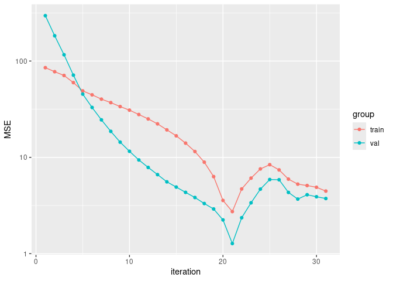
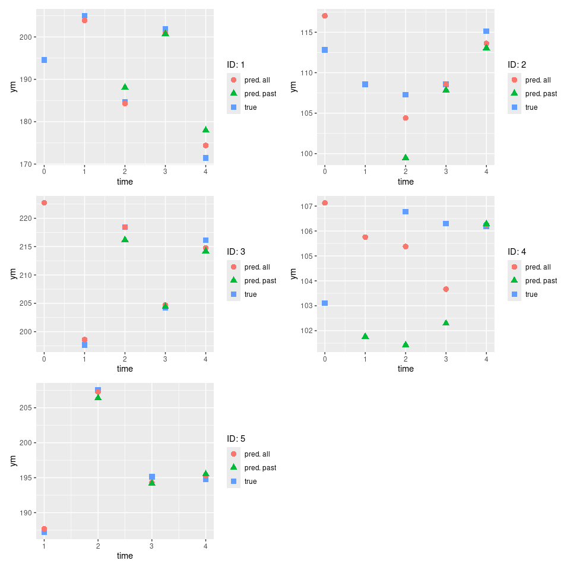

- [1 Introduction](#1-introduction)
- [2 Method](#2-method)
- [3 Working with Python](#3-working-with-python)
  - [3.1 Installation of the
    libraries](#31-installation-of-the-libraries)
  - [3.2 Setup of `reticulate` environment
    variables](#32-setup-of-reticulate-environment-variables)
  - [3.3 Note to devs](#33-note-to-devs)
- [4 Example dataset](#4-example-dataset)
- [5 Main/fit functions](#5-mainfit-functions)
  - [5.1 Formalism](#51-formalism)
  - [5.2 Arguments](#52-arguments)
  - [5.3 Example](#53-example)
- [6 Model attributes](#6-model-attributes)
- [7 Post-fit functions](#7-post-fit-functions)
  - [7.1 `predict`](#71-predict)
  - [7.2 `plot_conv`](#72-plot_conv)
  - [7.3 `plot_loglik`](#73-plot_loglik)
  - [7.4 `plot_prediction_check`](#74-plot_prediction_check)
  - [7.5 `save_mixedml`](#75-save_mixedml)
  - [7.6 `load_mixedml`](#76-load_mixedml)
- [8 Remark on logging](#8-remark-on-logging)

<!-- README.md is generated from README.Rmd. Please edit that file -->

<!-- badges: start -->

[](https://github.com/FrankwaP/mixedML/actions/workflows/R-CMD-check.yaml)
<!-- badges: end -->

# 1 Introduction

This package provides functions to train hybrid mixed effects models.
Such models are a variation of linear mixed effects models, used for
Gaussian longitudinal data, whose formulation is:

$$Y_{ij} = X_{ij} \beta +  Z_{ij} u_i + w_{i} + \varepsilon_{ij}$$

… where:

- $i$ is the subject,
- $j$ is the observation,
- $\beta$ is the vector of fixed effects and $X_{ij}$ is associated
  covariates,
- $u_i$ is the vector of random effects and $Z_{ij}$ the associated
  covariates,
- $w_i$ is a zero-mean Gaussian stochastic process (such as Brownian
  motion) modeling the correlation in the individual error,
- $\epsilon_{ij}$ is the zero-mean Gaussian residual error.
- 

For such hybrid models:

- a Machine Leaning (ML) model is used to estimates the fixed effects;
- a Mixed Effects model (`hlme` from [lcmm
  package](https://cecileproust-lima.github.io/lcmm/articles/lcmm.html))
  is constrained to estimate only random effects.

That is, the formulation becomes:

$$Y_{ij} = f_{ML}(X_{ij}) +  Z_{ij} u_i + w_{i} + \varepsilon_{ij}$$

… where $f_{ML}(X_{ij})$ is the output from a ML model trained to
predict the fixed effects.

Using ML models to estimates the fixed effects has two main advantages
comparing to linear models:

- they can handle highly non-linear relations, and do so with simple
  inputs (instead of being highly dependent of the specification);
- they can handle complex time interactions, in the case of Recurrent
  Neural Networks;

However, some ML models have a “black box” effect, as one cannot use its
estimated parameters to understand the relations within the data.

# 2 Method

The method uses a iterative training of both fixed effects and random
effects models.

So far we are fitting each model on the **residuals** of the other. This
is only valid for **regression problems** where

- in generalized linear model terms: the models use an identity link,
- in neural networks terms: the models do not use a final activation
  function.

In such case, fitting on the residuals is equivalent to fitting using
the predictions (of the other model) as offset.

The pseudo-code is as follow (`fe`/`re` stands for fixed/random
effects):

    ml_model_fe <- initiate_ml_model_fe()
    hlme_model_re <- initiate_hlme_model_re()

    Yre <- 0.
    while not converged:
      fit ml_model_fe on X and (Y - Yre)
      Yfe <-  ml_model_fe(X)

      fit hlme_model_re on X and (Y - Yfe)
      Yre <-  hlme_model_re(X)

      converged <- criterion(Y, Yfe+Yre)

This method works with any kind of model, so far models coded in R and
Python acn be easily implemented.

# 3 Working with Python

The `reticulate` package is used to extend the choice of ML model to the
one available in Python packages.

## 3.1 Installation of the libraries

One must of course install the necessary Python packages before running
the corresponding models:

- the `requirements.txt` lists the packages needed to run all the ML
  models.
- the `requirements-dev.txt` lists the packages needed for developpers.

The recommended practice is to use a specific environments. Tools like
`venv`, `miniforge` or `uv` can be used for that purpose.

## 3.2 Setup of `reticulate` environment variables

Before using `reticulate` it is necessary to set up the
RETICULATE_PYTHON or the RETICULATE_PYTHON_ENV environment variable, as
explained in the `reticulate`
[documentation](https://rstudio.github.io/reticulate/articles/versions.html).

To define such environment variable, one can use a R command. For
example:

``` r
# if one wants to use the Python executable path (Windows example)
Sys.setenv(RETICULATE_PYTHON = "%HOMEPATH%/python3.13/bin/python.exe")

# if one wants to use a Python environment (Linux/OSX example)
Sys.setenv(RETICULATE_PYTHON_ENV = "~/miniforge3/envs/environment_name/")
```

Such command can be written in the `.Rprofile` of a project, to be
executed automatically when this project is loaded. This allows
different projects to use different variables.

**Please note** that if `reticulate` has already been called, then one
must restart the R session after changing these variables.

## 3.3 Note to devs

Specific helpers are available in the `R/utils.R` files.

It is important to make sure that the R object are propperly transfered
to Python, with the expected classes. See [Type
Conversions](https://cran.r-project.org/web/packages/reticulate/vignettes/calling_python.html)
in `reticulate` documentation. One tricky exemple: a user will enter `1`
as an integer, but this is actully a `numeric` in R, which will become a
`float` in Python. So if an `int` is expected on Python side, one needs
to use `as.integer`.

# 4 Example dataset

The dataset `data_mixedml` is proposed. It is generated using the
`R/data_gen.R` file.

It is a synthetic longitudinal dataset, containing data for 10 subjects
on 5 regularly spaced time steps. It contains two response columns for
both fixed and mixed effects. NA values have been added manually, and
some observations are deleted. Also the row names have been shuffled in
order to enforce a clear use of row names or indices in the code.

``` r
data_mixedml
#>    ID time    x1    x2 x3    yf     yr    ym ym_nonoise
#> 39  1    0    NA 100.6  1 206.9 -12.76 194.5      194.2
#> 35  1    1 11.01 103.5  1 217.9 -13.29 205.0      204.6
#> 10  1    2  9.82  97.9  1 197.3 -12.29 184.7      185.0
#> 1   1    3 11.01  98.2  1 215.3 -12.88 201.8      202.4
#> 42  1    4  8.89  98.5  1 183.6 -11.89 171.5      171.7
#> 49  2    0 10.38  97.5  0 101.7  10.97 112.8      112.6
#> 19  2    1  9.35    NA  0  97.4  11.28 108.6      108.7
#> 43  2    2  9.60  97.7  0  97.8  11.06 107.3      108.9
#> 6   2    3  9.10 102.2  0  97.6  11.66 108.6      109.3
#> 18  2    4  9.98 103.8  0 102.8  11.79 115.1      114.6
#> 25  3    0 11.08  97.0  1 215.6  13.11    NA      228.7
#> 33  3    1  9.11  97.3  1 186.4  11.92 197.6      198.3
#> 37  3    2 10.43  96.0  1 205.5  12.65 218.5      218.2
#> 2   3    3  9.14 105.8  1 191.0  12.48 204.2      203.5
#> 31  3    4 10.07 102.0  1 203.0  12.81 216.1      215.8
#> 16  4    0  9.96  98.8  0 100.2   3.43 103.1      103.6
#> 15  4    1 10.43 100.6  0 103.4   3.29    NA      106.7
#> 26  4    2 10.17 101.2  0 102.5   3.53 106.8      106.0
#> 13  4    3  9.71 104.9  0 102.0   4.23 106.3      106.2
#> 34  4    4 10.39  99.8  0 102.9   3.24 106.2      106.1
#> 23  5    1  9.41  99.6  1 191.9  -3.72 187.2      188.2
#> 22  5    2 10.63 102.1  1 211.6  -3.97 207.5      207.6
#> 11  5    3  9.84 100.6  1 198.9  -3.81 195.1      195.1
#> 50  5    4 10.02  96.3  1 199.4  -3.74 194.8      195.6
#> 46  6    0  9.26  99.8  0  97.2  16.39 113.9      113.6
#> 7   6    2  9.12  91.2  0  92.2  15.33 108.3      107.5
#> 40  6    3  9.47  98.1  0  97.4  16.31 114.1      113.7
#> 44  6    4  9.33  98.3  0  96.8  16.26 112.6      113.1
#> 28  7    0 10.38 104.5  1 208.9  -6.09 202.7      202.8
#> 38  7    1  9.68 102.7  1 197.5  -5.55 192.6      192.0
#> 4   7    2 10.72  99.0  1 211.2  -6.52 204.5      204.7
#> 14  7    3  9.69  96.1  1 194.4  -5.73 189.8      188.7
#> 24  7    4 10.11 100.0  1 202.7  -5.99 196.1      196.7
#> 9   8    0 10.13 103.0  0 103.2  -7.37  96.1       95.8
#> 17  8    1 10.21 101.2  0 102.7  -7.30  94.6       95.4
#> 32  8    2  9.26 104.3  0  99.4  -7.24  92.9       92.2
#> 45  8    3 10.09 100.4  0 101.7  -7.23  94.8       94.4
#> 30  8    4 11.03  96.0  0 104.1  -7.22  96.6       96.9
#> 12  9    0 10.36  98.5  1 205.7   2.49 208.0      208.2
#> 48  9    1  9.76  97.3  1 196.0   2.51 198.4      198.5
#> 36  9    2  9.76 101.0  1 197.8   2.64 201.2      200.5
#> 29  9    3 10.92 100.9  1 215.3   2.51 217.7      217.8
#> 5   9    4 10.26  96.9  1 203.3   2.44 205.5      205.7
#> 47 10    0  9.44 101.2  0  98.8 -21.28  77.2       77.5
#> 8  10    1  9.84 102.4  0 101.4 -21.84  79.4       79.6
#> 20 10    2 10.05  98.3  0 100.4 -21.58  77.4       78.8
#> 3  10    3 10.32 100.5  0 102.9 -22.11  81.6       80.8
#> 41 10    4 10.19 100.1  0 102.0 -21.93  80.2       80.1
```

# 5 Main/fit functions

## 5.1 Formalism

The MixedML models are obtained using specific functions which have for
signature:

``` r
XXXX_mixedml(
  # parameters of the MixedML model (inpired by the hlme function definition)
  fixed_spec,
  random_spec,
  data_,
  subject,
  time,
  # parameters for MixedML method
  mixedml_controls,
  # controls (extra-parameters) for the hlme model
  hlme_controls,
  # controls (extra-parameters) specific to the implemented ML model
  controls_1, controls_2, et_caetera
)
```

… where `XXXX` takes the name of the ML model used for the fixed
effects. As an example, the Reservoir Computing model is named
`reservoir_mixedml`.

Using a dedicated function allows to benefit from the code-completion
since every arguments is explicitely specified (no optional arguments).

## 5.2 Arguments

The `fixed_spec`, `random_spec`, `cor`, `data`, `subject` and `time` are
used by both sub-models and are taken from the `hlme` function which can
be seen in [the lcmm package
documentation](https://cecileproust-lima.github.io/lcmm/reference/hlme.html)

Then several controls are defined, using specific functions whose names
correspond to the control names. That is, the `some_name_ctrls(…)`
function is used to define `some_name_controls` controls. Each control
has its specific help.

## 5.3 Example

Here is an example using the `reservoir_mixedml` function (here is the
[corresponding vignette](mixedML_reservoir.html)):

``` r
data_train <- data_mixedml[data_mixedml$ID < 9, ]
data_val <- data_mixedml[data_mixedml$ID >= 9, ]

model_reservoir <- reservoir_mixedml(
  fixed_spec = ym ~ x1 + x2 + x3,
  random_spec = ~ x1 + x2,
  data = data_train,
  data_val = data_val,
  subject = "ID",
  time = "time",
  # parameters for MixedML method
  mixedml_controls = mixedml_ctrls(
    earlystopping_controls = earlystopping_ctrls(min_mse_gain = 0.1, patience = 10),
    all_info_hlme_prediction = TRUE
  ),
  # controls (extra-parameters) for the hlme model
  hlme_controls = hlme_ctrls(maxiter = 50, idiag = TRUE),
  # controls (extra-parameters) for the ML model
  esn_controls = esn_ctrls(units = 20, ridge = 1e-5),
  ensemble_controls = ensemble_ctrls(seed_list = c(1, 2, 3, 4, 5)),
  fit_controls = fit_ctrls(warmup = 1)
)
#> Warning in .check_na_combinaison(data_train, fixed_spec, random_spec, target_name): 
#>          2 incomplete cases for the ML models
#>          4 incomplete cases for the HLME model
#>          2 NA values in target
#>          => 4/38 observations could not be used to train (either no fixed preds, random preds or target).
#> step#1
#>  fitting fixed effects...
#>  fitting random effects...
#>  MSE-train = 85.38
#>  MSE-val = 296.1
#>  (saving best model)
#>  (improvement)
#> step#2
#>  fitting fixed effects...
#>  fitting random effects...
#>  MSE-train = 77.51
#>  MSE-val = 183.1
#>  (saving best model)
#>  (improvement)
#> step#3
#>  fitting fixed effects...
#>  fitting random effects...
#>  MSE-train = 70.84
#>  MSE-val = 116.2
#>  (saving best model)
#>  (improvement)
#> step#4
#>  fitting fixed effects...
#>  fitting random effects...
#>  MSE-train = 59.75
#>  MSE-val = 71.43
#>  (saving best model)
#>  (improvement)
#> step#5
#>  fitting fixed effects...
#>  fitting random effects...
#>  MSE-train = 49
#>  MSE-val = 45.37
#>  (saving best model)
#>  (improvement)
#> step#6
#>  fitting fixed effects...
#>  fitting random effects...
#>  MSE-train = 44.6
#>  MSE-val = 32.97
#>  (saving best model)
#>  (improvement)
#> step#7
#>  fitting fixed effects...
#>  fitting random effects...
#>  MSE-train = 40.23
#>  MSE-val = 24.51
#>  (saving best model)
#>  (improvement)
#> step#8
#>  fitting fixed effects...
#>  fitting random effects...
#>  MSE-train = 37.03
#>  MSE-val = 18.62
#>  (saving best model)
#>  (improvement)
#> step#9
#>  fitting fixed effects...
#>  fitting random effects...
#>  MSE-train = 33.69
#>  MSE-val = 14.39
#>  (saving best model)
#>  (improvement)
#> step#10
#>  fitting fixed effects...
#>  fitting random effects...
#>  MSE-train = 30.91
#>  MSE-val = 11.56
#>  (saving best model)
#>  (improvement)
#> step#11
#>  fitting fixed effects...
#>  fitting random effects...
#>  MSE-train = 27.85
#>  MSE-val = 9.402
#>  (saving best model)
#>  (improvement)
#> step#12
#>  fitting fixed effects...
#>  fitting random effects...
#>  MSE-train = 25.07
#>  MSE-val = 7.859
#>  (saving best model)
#>  (improvement)
#> step#13
#>  fitting fixed effects...
#>  fitting random effects...
#>  MSE-train = 22.28
#>  MSE-val = 6.621
#>  (saving best model)
#>  (improvement)
#> step#14
#>  fitting fixed effects...
#>  fitting random effects...
#>  MSE-train = 19.3
#>  MSE-val = 5.57
#>  (saving best model)
#>  (improvement)
#> step#15
#>  fitting fixed effects...
#>  fitting random effects...
#>  MSE-train = 16.74
#>  MSE-val = 4.915
#>  (saving best model)
#>  (improvement)
#> step#16
#>  fitting fixed effects...
#>  fitting random effects...
#>  MSE-train = 14.05
#>  MSE-val = 4.331
#>  (saving best model)
#>  (improvement)
#> step#17
#>  fitting fixed effects...
#>  fitting random effects...
#>  MSE-train = 11.5
#>  MSE-val = 3.83
#>  (saving best model)
#>  (improvement)
#> step#18
#>  fitting fixed effects...
#>  fitting random effects...
#>  MSE-train = 8.912
#>  MSE-val = 3.315
#>  (saving best model)
#>  (improvement)
#> step#19
#>  fitting fixed effects...
#>  fitting random effects...
#>  MSE-train = 6.313
#>  MSE-val = 2.91
#>  (saving best model)
#>  (improvement)
#> step#20
#>  fitting fixed effects...
#>  fitting random effects...
#>  MSE-train = 3.57
#>  MSE-val = 2.241
#>  (saving best model)
#>  (improvement)
#> step#21
#>  fitting fixed effects...
#>  fitting random effects...
#>  MSE-train = 2.736
#>  MSE-val = 1.274
#>  (saving best model)
#>  (improvement)
#> step#22
#>  fitting fixed effects...
#>  fitting random effects...
#>  MSE-train = 4.699
#>  MSE-val = 2.361
#>  (no improvement #1)
#> step#23
#>  fitting fixed effects...
#>  fitting random effects...
#>  MSE-train = 6.087
#>  MSE-val = 3.373
#>  (no improvement #2)
#> step#24
#>  fitting fixed effects...
#>  fitting random effects...
#>  MSE-train = 7.583
#>  MSE-val = 4.677
#>  (no improvement #3)
#> step#25
#>  fitting fixed effects...
#>  fitting random effects...
#>  MSE-train = 8.396
#>  MSE-val = 5.886
#>  (no improvement #4)
#> step#26
#>  fitting fixed effects...
#>  fitting random effects...
#>  MSE-train = 7.41
#>  MSE-val = 5.855
#>  (no improvement #5)
#> step#27
#>  fitting fixed effects...
#>  fitting random effects...
#>  MSE-train = 5.943
#>  MSE-val = 4.325
#>  (no improvement #6)
#> step#28
#>  fitting fixed effects...
#>  fitting random effects...
#>  MSE-train = 5.273
#>  MSE-val = 3.688
#>  (no improvement #7)
#> step#29
#>  fitting fixed effects...
#>  fitting random effects...
#>  MSE-train = 5.097
#>  MSE-val = 4.091
#>  (no improvement #8)
#> step#30
#>  fitting fixed effects...
#>  fitting random effects...
#>  MSE-train = 4.891
#>  MSE-val = 3.9
#>  (no improvement #9)
#> step#31
#>  fitting fixed effects...
#>  fitting random effects...
#>  MSE-train = 4.465
#>  MSE-val = 3.738
#>  (no improvement #10)
#> Warning in mixedml_training_loop(fixed_model, fixed_spec, random_spec, data, :
#> Conditions defined in early_stopping: aborting training loop!
#> Final convergence of HLME with strict convergence criterions.
```

The resulting model will be used in the remaining sections.

# 6 Model attributes

Each sub-models are accessible from the fitted MixedML model:

``` r
model_reservoir$random_model
#> Heterogenous linear mixed model 
#>      fitted by maximum likelihood method 
#>  
#> hlme(fixed = ym ~ 1, random = ~x1 + x2, subject = "ID", idiag = TRUE, 
#>     cor = NULL, data = data, convB = 1e-04, convL = 1e-04, convG = 1e-04, 
#>     maxiter = 50, na.action = 1, posfix = 1, verbose = FALSE, 
#>     var.time = "time", nproc = 1)
#>  
#> Statistical Model: 
#>      Dataset: data 
#>      Number of subjects: 8 
#>      Number of observations: 34 
#>      Number of observations deleted: 4 
#>      Number of latent classes: 1 
#>      Number of parameters: 5  
#>      Number of estimated parameters: 4  
#>  
#> Iteration process: 
#>      Convergence criteria satisfied 
#>      Number of iterations:  2 
#>      Convergence criteria: parameters= 8.6e-05 
#>                          : likelihood= 7.9e-07 
#>                          : second derivatives= 3.9e-10 
#>  
#> Goodness-of-fit statistics: 
#>      maximum log-likelihood: -103.19  
#>      AIC: 214.37  
#>      BIC: 214.69  
#>  
#> 
```

``` r
# (this model uses reticulate so it not very convenient as an example…)
model_reservoir$fixed_model
#> <reservoir_ensemble.JoblibReservoirEnsemble object at 0x7c9015e99a90>
```

Also a `call` attribute exists, meaning one can trained the model with
new inputs using `update` command:

``` r
new_model_reservoir <- update(model_reservoir, data = new_data, maxiter = new_maxiter)
```

# 7 Post-fit functions

The following functions are common to all fitted MixedML models.

## 7.1 `predict`

``` r
predict(model = model_reservoir, data = data_mixedml, all_info_hlme_prediction = FALSE, nproc_hlme_past = 1)
#>    39    35    10     1    42    49    19    43     6    18    25    33    37 
#>    NA    NA 188.1 200.7 178.0    NA    NA  99.5 107.8 113.1    NA    NA 216.2 
#>     2    31    16    15    26    13    34    23    22    11    50    46     7 
#> 204.4 214.2    NA 101.8 101.4 102.3 106.3    NA 206.4 194.2 195.5    NA 107.0 
#>    40    44    28    38     4    14    24     9    17    32    45    30    12 
#> 110.3 111.6    NA 191.8 203.3 188.6 197.1    NA  91.9  90.5  93.9  94.2    NA 
#>    48    36    29     5    47     8    20     3    41 
#> 198.5 200.2 215.5 207.0    NA  75.7  77.6  80.6  79.2
```

## 7.2 `plot_conv`

``` r
plot_conv_mse(model = model_reservoir, ylog = TRUE)
```



## 7.3 `plot_loglik`

``` r
plot_conv_loglik(model = model_reservoir)
```



## 7.4 `plot_prediction_check`

``` r
plot_prediction_check(model = model_reservoir, subject_nb_or_list = c(1, 2, 3, 4, 5))
#> Warning: Removed 4 rows containing missing values or values outside the scale range
#> (`geom_point()`).
```


## 7.5 `save_mixedml`

This function is used to save a mixedML model. It is **mandatory** when
using a model based on a Python package, since we need to save both R
and Python objects.

``` r
save_mixedml(model_reservoir, mixedml_model_rds = "model_reservoir.Rds")
```

## 7.6 `load_mixedml`

This function is used to load a mixedML model. It is **mandatory** when
using a model based on a Python package, since we need to load both R
and Python objects.

``` r
mixedml_model <- load_mixedml("model_reservoir.Rds")
```

``` r
mixedml_model$fixed_model
#> <reservoir_ensemble.JoblibReservoirEnsemble object at 0x7c9015e9a350>
```

``` r
mixedml_model$random_model
#> Heterogenous linear mixed model 
#>      fitted by maximum likelihood method 
#>  
#> hlme(fixed = ym ~ 1, random = ~x1 + x2, subject = "ID", idiag = TRUE, 
#>     cor = NULL, data = data, convB = 1e-04, convL = 1e-04, convG = 1e-04, 
#>     maxiter = 50, na.action = 1, posfix = 1, verbose = FALSE, 
#>     var.time = "time", nproc = 1)
#>  
#> Statistical Model: 
#>      Dataset: data 
#>      Number of subjects: 8 
#>      Number of observations: 34 
#>      Number of observations deleted: 4 
#>      Number of latent classes: 1 
#>      Number of parameters: 5  
#>      Number of estimated parameters: 4  
#>  
#> Iteration process: 
#>      Convergence criteria satisfied 
#>      Number of iterations:  2 
#>      Convergence criteria: parameters= 8.6e-05 
#>                          : likelihood= 7.9e-07 
#>                          : second derivatives= 3.9e-10 
#>  
#> Goodness-of-fit statistics: 
#>      maximum log-likelihood: -103.19  
#>      AIC: 214.37  
#>      BIC: 214.69  
#>  
#> 
```

# 8 Remark on logging

The use of reticulate makes it cumbersome to implement logging in the
package. Since the solutions found involve preventing the use of Rstudio
and favor running from terminal, one simple solution is to write a
standard R script and call it from the terminal, redirecting both stdout
and stderr to a log file:

``` bash
Rscript name_of_script.R > log_file.log 2>&1
```
